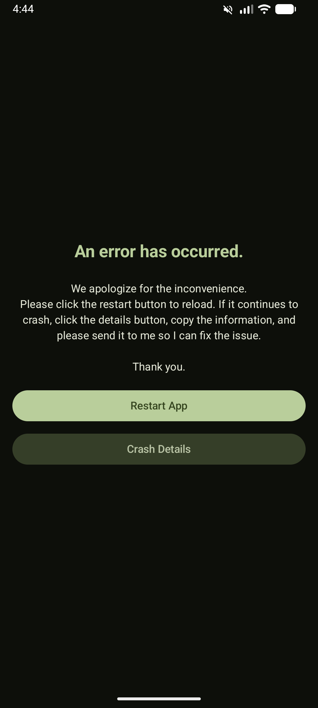
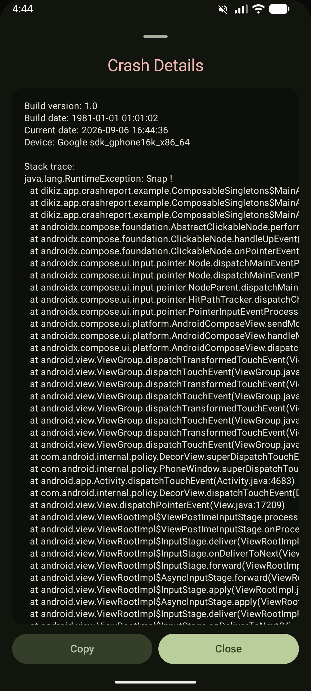

# CrashReport Library

A simple, idiomatic Kotlin library to handle uncaught exceptions in Android applications. It automatically intercepts crashes and displays a customizable error activity instead of the standard "App has stopped" dialog.

## Features

- **Kotlin-First**: Fully refactored to idiomatic Kotlin using objects, properties, and `Parcelable`.
- **Zero-Setup**: Auto-initializes using a `ContentProvider`.
- **Customizable**: Configure background behavior, restart activities, custom UI, and more.
- **Compose Ready**: The default error activity is built with Jetpack Compose.
- **Activity Tracking**: Optionally tracks activity lifecycles to help debug the path to a crash.

## Preview

|        Main Screen         |       Crash Occurred        |         Crash Details         |
|:--------------------------:|:---------------------------:|:-----------------------------:|
|  |  |  |

## Integration

### 1. Add dependency
Add the library to your `build.gradle.kts`:


```kotlin
dependencies {
    implementation("io.github.otangid:CreashReportCompose:$version")
}
```

### 2. Configuration (Optional)
You can customize the behavior in your `Application` class or main activity:

```kotlin
CrashActivity.setConfig(
    CrashConfig(
        isEnabled = true,
        isShowRestartButton = true,
        isTrackActivities = true,
        restartActivityClass = MainActivity::class.java
    )
)
```

## License
MIT License
